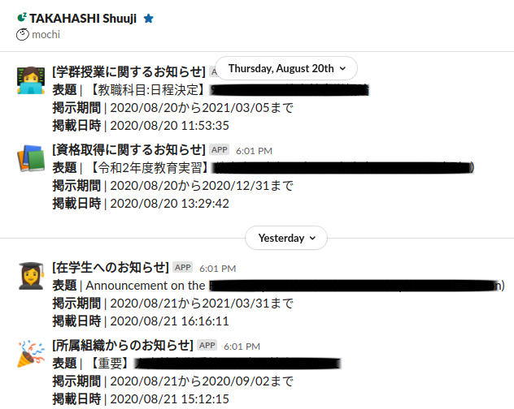

# 📡 twins-notification

筑波大学の[Twins](https://twins.tsukuba.ac.jp/)の掲示板のお知らせを通知してくれるプログラムです。Twinsの掲示板を確認するのが大変な人のために作りました。

## スクリーンショット



💻 Slackへの通知例

## 使い方

1. `.env.example`を`.env`にコピーする。
1. `.env`に必要な情報を入力する。
1. `twins-notification.config.yaml`を自分好みに設定する。

### Node.jsを使用する場合

1. `yarn install`を実行する(初回のみ)。
1. `yarn start`を実行する。
1. Slackに通知が来るはずです。

### コンテナを使用する場合

```shell
make build
make run
```

### KubernetesクラスタにCronJobとしてデプロイする場合

```shell
make build
make push
make deploy
```

## 現在の制限事項

- WebhookのpayloadがSlackに適した形式にしか対応していません。
  - Slackの通知で満足してしまいそうなので、他の通知方法に対応するかどうかは未定です。RSSで出力したり、メールで1週間のお知らせを通知できたら嬉しいかも？
- 通知範囲の指定方法が、「現在から指定日数前」以外に存在しません。
- お知らせ一覧に書かれた情報しか通知してくれません。
  - Twinsには各お知らせに対するPermalinkが存在しないため、お知らせの詳細がわかりません。([issue #1](https://github.com/shuuji3/twins-notification/issues/1))
- エラーハンドリングをちゃんとしていません。

## ライセンス

[GNU General Public License v3.0](./LICENSE)
